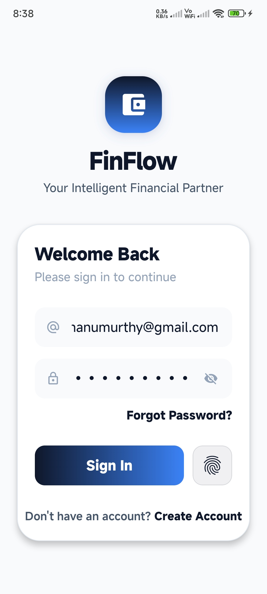
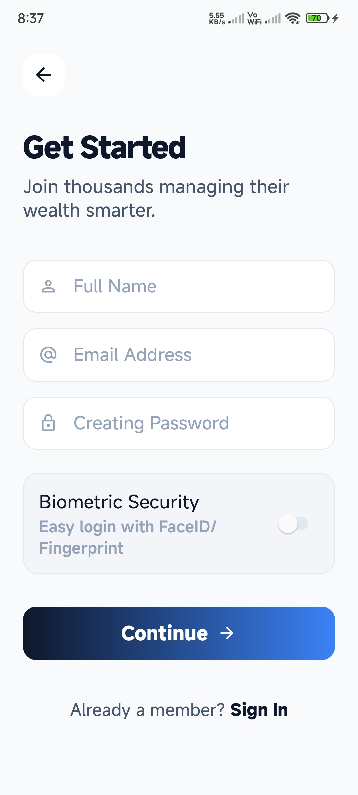
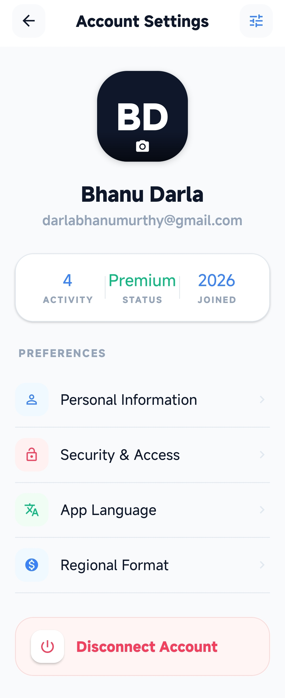
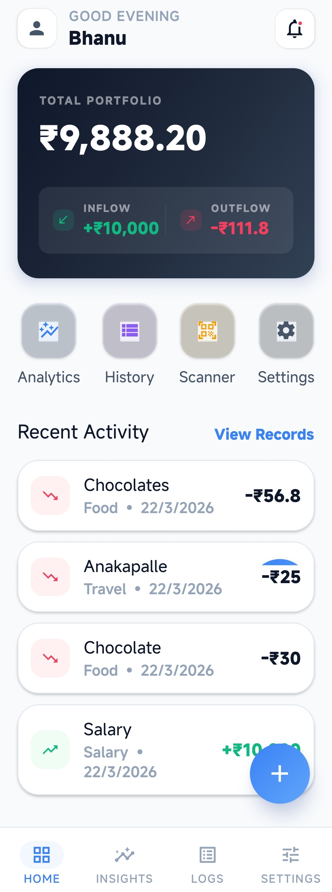
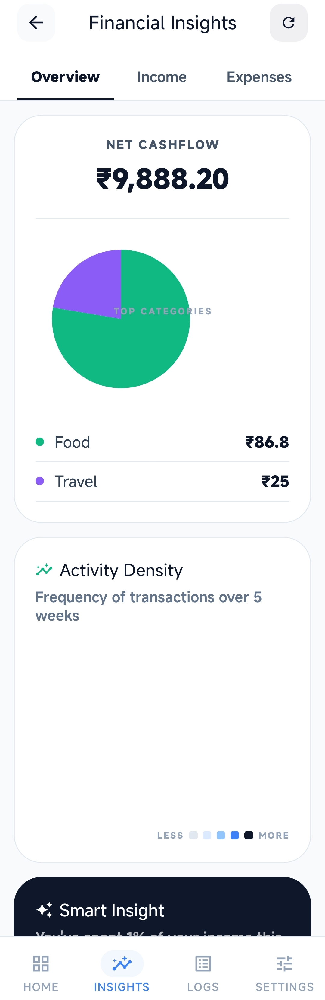
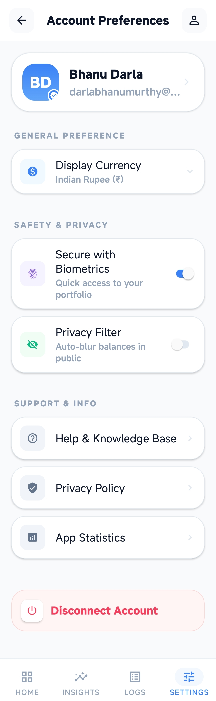
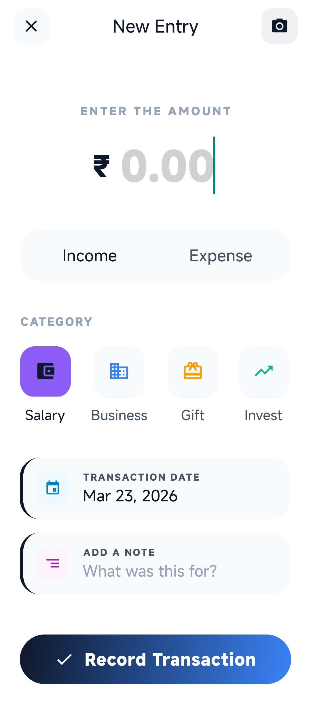
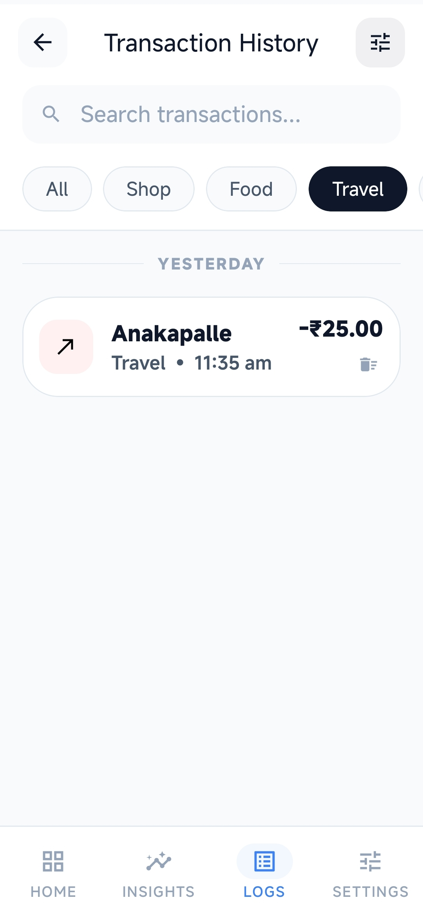
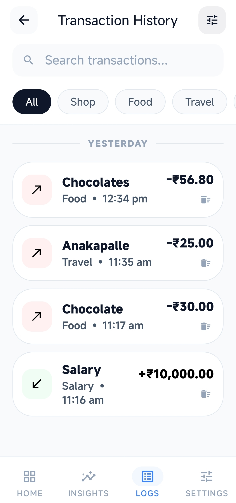
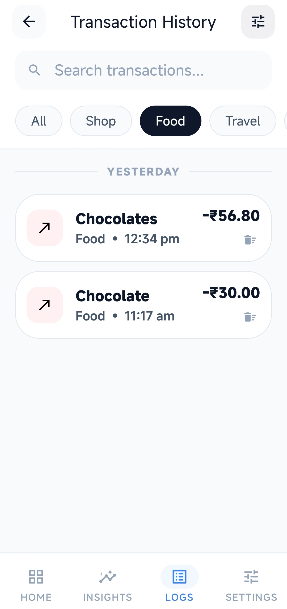

# 📈 FinFlow Pro: Premium Intelligent Finance Tracker

**FinFlow Pro** is an elite, high-performance financial management ecosystem designed for modern users who demand precision, security, and aesthetics. This full-stack application provides a world-class banking experience, featuring AI-driven insights, advanced biometric protection, and a glassmorphic "Elite" design system.

---

## 🛠️ Created By
**Darla Bhanumurthy**

---

## 📱 Application Flow

### **A. Onboarding & Security**

  
  
  

> **Elite Security**: High-impact login with biometric support and persistent session handling.

---

### **B. Financial Dashboard & Insights**

  
  
  

> **Intelligent Overview**: Premium glassmorphic cards for balance, real-time analytics, and account preferences.

---

### **C. Transaction Lifecycle**

  
  
  
  

> **Precision Tracking**: Effortlessly manage inflows and outflows with categorized history and real-time push notifications.

---

## 💎 Project Overview
**FinFlow Pro** is more than just a spend tracker; it is a comprehensive financial vault. The application is built using the **MERN** stack (MongoDB, Express, React Native, Node.js) and optimized for low-latency cloud synchronization. It solves the pain point of manual data entry through AI-assisted receipt scanning and provides deep visual analytics to help users optimize their wealth.

---

## 🚀 Built With

### **Frontend Implementation** (Mobile)

  
  
  
  
  

### **Backend Infrastructure** (API)

  
  
  
  
  

---

## 💎 Key Features & Innovations

### 🎨 1. Elite "FinTech" Design System
*   **Modern Aesthetics**: Implements **Glassmorphism**, neon emerald accents, and a deep-sea professional palette.
*   **Responsive Typography**: Optimized scaling for every screen size using a standardized elite theme.

### 🤖 2. Intelligent AI Vision Scanner
*   **Automated Entry**: Uses an AI-driven vision interface to scan receipts and bills.
*   **Futuristic UI**: A neon scanning frame with real-time indicators provides a high-tech utility feel.

### 🔐 3. Advanced Security & Zero-Leak Privacy
*   **Biometric Vault**: Secure your financial data with **Fingerprint/FaceID** authentication.
*   **Privacy Mode**: A specialized "Ghost Mode" that instantly blurs all sensitive balances in public.

### 📡 4. Real-Time Smart Notifications
*   **Instant Alerts**: Integrated with **Expo Notifications** to fire localized high-impact alerts immediately upon any transaction activity.

### 🔄 5. Persistent "Always-on" Session
*   **Seamless Access**: Re-opening the app bypasses the login screen by rehydrating the secure session from **AsyncStorage**.

---

## 🏗️ Technical Architecture Details

*   **Zustand (Persist Middleware)**: For ultra-fast, predictable state management.
*   **Axios Interceptors**: A robust API layer with global logging and automatic token injection.
*   **bcrypt.js**: Hardware-accelerated hashing for specialized user password encryption.

---

## 🚀 Getting Started

### 1. Backend Setup
1.  Go to `backend/` and create a `.env` file.
2.  Add your `MONGO_URI`, `PORT`, and `JWT_SECRET`.
3.  Run `npm install` and `npm start`.

### 2. Mobile Setup
1.  Go to `mobile/`.
2.  Run `npm install`.
3.  Start with `npx expo start`.

---

## 📜 License
This project is licensed under the **MIT License** - see the [LICENSE](LICENSE) file for details.

---

  <b>Designed & Engineered by Darla Bhanumurthy</b> 
  Empowering financial freedom through intelligent design. 🚀

  <b>Wanna Contribute in this project to add more features? Do it</b> 
 By making a pull request to this repo.

